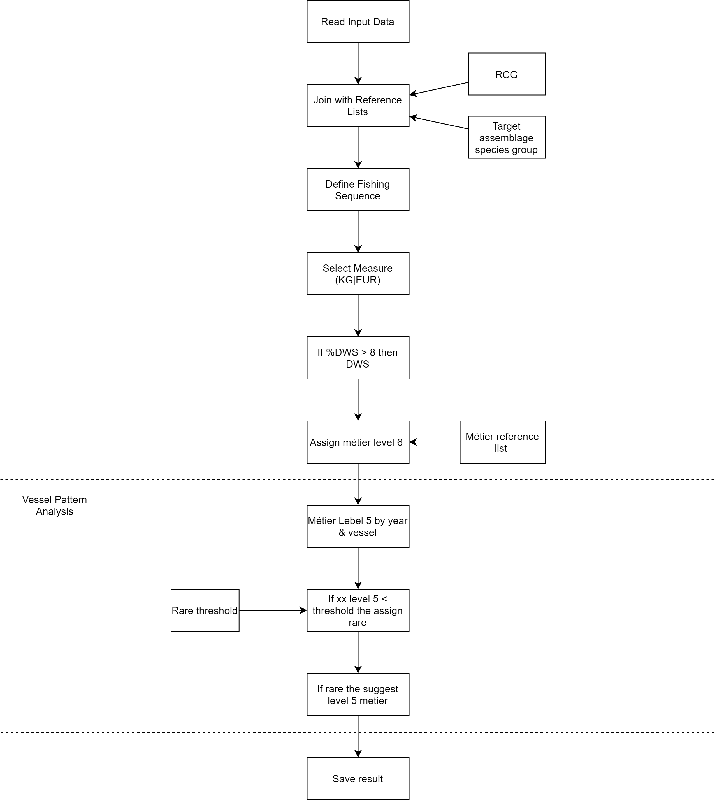

# Workflow diagramm


```{r diagramTest, eval=FALSE, include=FALSE}

p <- grViz("digraph {
  graph [layout = dot, overlap = TRUE, rankdir = TB]
  
  node [group = a, shape = rectangle]        
  rec1 [label = 'Read Input Data']
  rec2 [label = 'Join with Reference List']
  rec5 [label = 'Define Fishing Sequence']
  rec6 [label = 'Select Measure (kg|euro)']
  rec7 [label = 'If % DWS > 8 then DWS']
  
  rec1 -> rec2 -> rec5 -> rec6 -> rec7
  
  node [group = b, shape = rectangle]
  rec3 [label = 'Target Assemblage Species Group']
  rec4 [label = 'RCG']

  rec3 -> rec2 
  rec4 -> rec2 

  }")
htmlwidgets::saveWidget(p, paste0(getwd(), "/p.html"))
webshot::webshot("p.html", "p.png")
```

