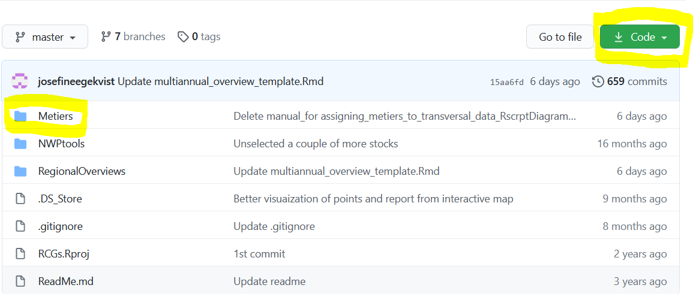
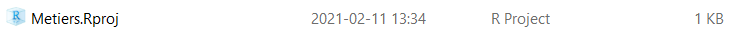
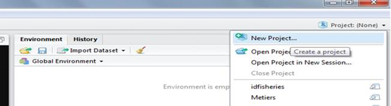
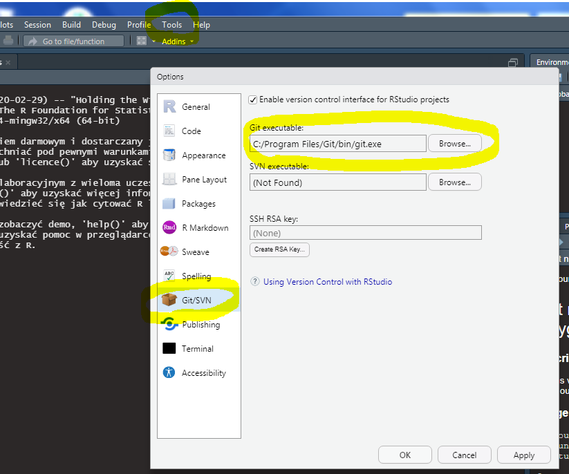

# Annex: Getting the code from GitHub {-}

There are several ways to get the code from GitHub, three different ways are described here:

**Download zip-file directly from GitHub** 

1.	On the GitHub link: https://github.com/ices-eg/RCGs there is a green button called “Code”. If clicking on that there is a possibility to download Zip. This will download all content of RCG ISSG’s at GitHub. 

 

 
2.	Unzip the file at your computer. Under the “Metiers” -> “Scripts” folders, you can find the script_metiers_test.R file. Under the “Functions” folder the functions that the script reads are located. In the beginning of the script, make sure that it points to the Functions folder to read the functions.

3.	To open the project from your computer under the “Metiers” folder  you should run “Metiers.Rproj”. Then the path to all functions will be valid.

 

 
**Using GitHub Desktop**

1.	Download GitHub Desktop here: https://desktop.github.com/

2.	Define a folder where a copy of the GitHub content should be copied to

3.	Set up the connection between GitHub RCGs url: https://github.com/ices-eg/RCGs and the folder on your computer. 

**Using Git for Windows**

1.	Install Git for Windows. You can download git from here https://git-scm.com/download/win. During the installation process you don’t have to change any options.

2.	Once you have git installed you can start your RStudio. In the top right corner there is a button called “Project”. You should click it and select New Project.

3.	A new window will show up. On that window select “Version Control”. Next select “Git”. In the next window you should enter the repository URL which is https://github.com/ices-eg/RCGs.git
Note that RStudio for Windows prefers for Git to be installed below C:/Program Files and this appears to be the default. This implies, for example, that the Git executable on Windows system should be found at C:/Program Files/Git/bin/git.exe.
In case when Git was installed in another directory you should select Tools -> Global options -> Git/SVN, and specify a path to the Git executable on your computer:
  

4.	In the field “Create project as a subdirectory of” you can choose the directory on your hard disk where you want this project to be downloaded. And then click “Create project”. After a while RStudio will download (clone) the repository from github to your disk. This repository contains data from many RCG sobgroups. The content for the metier assignment is in the “Metier” subfolder.
